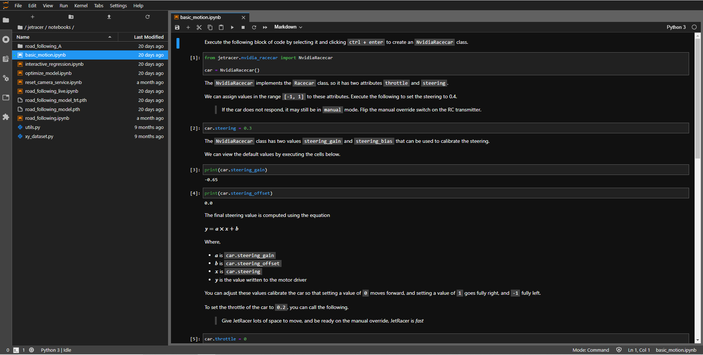
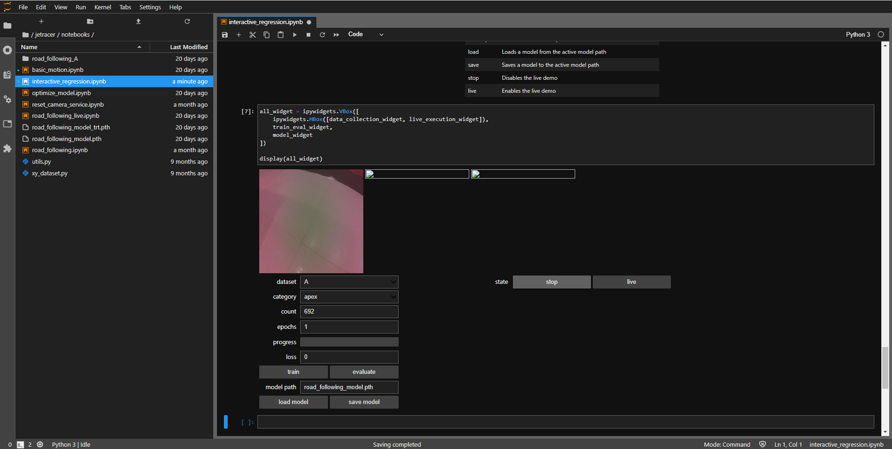

# Examples

Follow these examples to get started.
Also watch some tutorials on youtube about how to use jupyter notebook.  

> Ensure that your robot is connected to WiFi and you've note the IP address

## Example 1 - Basic Motion

In this example we'll show how to calibrate and test the robot programatically from a web browser.

1. Navigate to ``http://<jetson_ip_address>:8888``

2. Sign in with the default password ``jetson``
3. Browse to the folder ``~/jetracer/notebooks`` in the Jupyter Lab file browser
4. Run through the notebook ``basic_motion.ipynb``
5. After running the notebook you might notice a slight change in your steering position.
6. In order to center it, remove the servo horn and re-attach it while the robot is turned ON.
7. Now you can check the direction of drive motor. Put a value of 0.3 in car.throttle and press the run button on top panel.
8. If the wheels are spinning backwards/car is going backwards, just resolder the motor wires in opposite orientation (flip the motor wire polarity). To stop the wheels jut put 0 value again in car.throttle and press run button. 
9. You can do all these things in software as well.
10. Once you are sure about the steering and throttle control, close this notebook and move on to the next notebook i.e. interactive regression.

## Example 2 - Interactive Regression
   
Interactive Regression is used to train the robot. It is the machine learning part of this project.

1. Run all the cells until cell 6. Do not run cell 7 as it causes system to freeze.
2. Now we need to collect and label the data. Place the robot on the track and start clicking on the ideal line that your robot would follow. I have attached an example gif on how to collect data [source: NVIDIA jetracer repository github](https://github.com/NVIDIA-AI-IOT/jetracer). 

3. Once we have collected images of the track while following the center of the track, we need offet images; i.e. images from outside the track.
4. We are basically telling the robot what it should do in situations where robot ran off the track. Keep the robot offset/outside the track and click on the center of the track as we did earlier. This way the robot will return on the center of the track even if it went outside the track.
5. Corners are very important, make sure you train your robot with ample of images on-track and off-track as well.
6. Make sure you take at least 400 images all combined. Avoid clicking wrong images.
7. Once you have enough images in dataset A, go to the training part and keep the epochs to 15 and click on the train button.
8. When the training is completed click on the save model button, this will save your trained dataset in a file named road_following_model.pth
9. You are now done with training the model with the dataset (images) that you gave it. Close the interactive regression notebook. 
10. Now we need two notebooks optimize_model.ipynb and road_following_live.ipynb. You can download them from [NVIDIA jetracer repository github](https://github.com/NVIDIA-AI-IOT/jetracer).
11. Add these two notebooks in your notebook directory and follow the steps below. 

